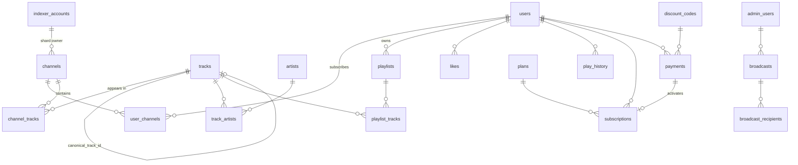

# DB.md — اسکیمای دیتابیس

> PostgreSQL 16 · وضعیت: **اجراشده** در `backend/migrations/sql/0001_initial.sql` و `0002_reference_data.sql`.
> **منبع حقیقت، فایل‌های migration هستند.** این سند توضیح طراحی است و تفاوت‌های زمان اجرا در انتهایش آمده‌اند.
> از این به بعد هیچ تغییری بدون migration انجام نمی‌شود. تست `tests/integration/test_schema_drift.py` ناسازگاری ORM با دیتابیس را می‌گیرد.

## قراردادها

| قرارداد | مقدار |
|---|---|
| کلید اصلی داخلی | `bigint GENERATED ALWAYS AS IDENTITY` (سریع‌تر و کوچک‌تر از UUID برای join های پرتکرار) |
| شناسه‌های قابل‌نمایش بیرونی | `share_slug` تصادفی (base62، ۱۰ کاراکتر) — id داخلی هرگز در URL عمومی نیست |
| شناسه‌های تلگرام | `bigint` (آیدی کانال‌ها از ۲^۳۱ بزرگ‌ترند) |
| زمان | همیشه `timestamptz`، همیشه UTC |
| پول | `amount bigint` به کوچک‌ترین واحد (ریال / Star) + `currency text` — هرگز float |
| حذف | soft-delete فقط جایی که لازم است (`hidden`, `deleted_at`)؛ بقیه hard با `ON DELETE CASCADE` |
| enum ها | `text` + `CHECK` — افزودن مقدار جدید بدون `ALTER TYPE` قفل‌دار |
| صفحه‌بندی | keyset روی `(sort_key, id)` — هر ایندکس لیستی این زوج را دارد |

> ترتیب بلاک‌های این سند برای خوانایی است، نه برای اجرا. چند FK رو به جلو دارند (`users→plans`، `subscriptions→payments`، `payments→discount_codes/admin_users`). در migration فاز ۱، جدول‌ها به ترتیب وابستگی ساخته می‌شوند.

## اکستنشن‌ها

```sql
CREATE EXTENSION IF NOT EXISTS pg_trgm;
CREATE EXTENSION IF NOT EXISTS citext;
CREATE EXTENSION IF NOT EXISTS btree_gin;
```

---

## ۱. کاربران و احراز هویت

```sql
CREATE TABLE users (
    id                    bigint GENERATED ALWAYS AS IDENTITY PRIMARY KEY,
    tg_id                 bigint      NOT NULL UNIQUE,
    username              citext,
    first_name            text        NOT NULL,
    last_name             text,
    lang                  text        NOT NULL DEFAULT 'fa' CHECK (lang IN ('fa','en')),
    tg_is_premium         boolean     NOT NULL DEFAULT false,      -- پرمیوم خود تلگرام، نه ما
    plan_code             text        NOT NULL DEFAULT 'free' REFERENCES plans(code),
    premium_until         timestamptz,                             -- denormalized از subscriptions برای چک سریع
    trial_used            boolean     NOT NULL DEFAULT false,
    referred_by           bigint      REFERENCES users(id) ON DELETE SET NULL,
    referral_code         text        NOT NULL UNIQUE,
    country               text,
    tos_version_accepted  text,
    bot_blocked           boolean     NOT NULL DEFAULT false,      -- از خطای 403 پیام همگانی
    is_banned             boolean     NOT NULL DEFAULT false,
    ban_reason            text,
    daily_plays           int         NOT NULL DEFAULT 0,          -- ریست در job نیمه‌شب
    public_profile        boolean     NOT NULL DEFAULT true,
    created_at            timestamptz NOT NULL DEFAULT now(),
    last_seen_at          timestamptz NOT NULL DEFAULT now()
);
CREATE INDEX users_username_trgm   ON users USING gin (username gin_trgm_ops);
CREATE INDEX users_created_keyset  ON users (created_at, id);
CREATE INDEX users_last_seen       ON users (last_seen_at);
CREATE INDEX users_premium_expiry  ON users (premium_until) WHERE premium_until IS NOT NULL;

CREATE TABLE refresh_tokens (
    id           bigint GENERATED ALWAYS AS IDENTITY PRIMARY KEY,
    user_id      bigint      NOT NULL REFERENCES users(id) ON DELETE CASCADE,
    family_id    uuid        NOT NULL,              -- استفادهٔ مجدد از توکن مصرف‌شده → کل family باطل
    token_hash   bytea       NOT NULL UNIQUE,       -- sha256، توکن خام هرگز ذخیره نمی‌شود
    device       text,
    used_at      timestamptz,
    revoked_at   timestamptz,
    expires_at   timestamptz NOT NULL,
    created_at   timestamptz NOT NULL DEFAULT now()
);
CREATE INDEX refresh_tokens_family ON refresh_tokens (family_id);

CREATE TABLE follows (
    follower_id  bigint NOT NULL REFERENCES users(id) ON DELETE CASCADE,
    followee_id  bigint NOT NULL REFERENCES users(id) ON DELETE CASCADE,
    created_at   timestamptz NOT NULL DEFAULT now(),
    PRIMARY KEY (follower_id, followee_id),
    CHECK (follower_id <> followee_id)
);
CREATE INDEX follows_followee ON follows (followee_id);
```

## ۲. کانال‌ها و ایندکس

```sql
CREATE TABLE channel_categories (
    id         int GENERATED ALWAYS AS IDENTITY PRIMARY KEY,
    slug       text NOT NULL UNIQUE,                -- pop-fa, rap, traditional, instrumental, foreign, remix
    name_fa    text NOT NULL,
    name_en    text NOT NULL,
    position   int  NOT NULL DEFAULT 0
);

CREATE TABLE indexer_accounts (
    id               int GENERATED ALWAYS AS IDENTITY PRIMARY KEY,
    phone_hint       text        NOT NULL,          -- فقط ۴ رقم آخر؛ شماره کامل فقط داخل session رمزشده
    session_path     text        NOT NULL,          -- فایل رمزشده روی EDGE
    status           text        NOT NULL DEFAULT 'healthy'
                     CHECK (status IN ('healthy','cooling','limited','banned','disabled')),
    cooling_until    timestamptz,
    joined_channels  int         NOT NULL DEFAULT 0 CHECK (joined_channels <= 500),
    floodwait_24h_s  int         NOT NULL DEFAULT 0,
    last_error       text,
    last_ok_at       timestamptz,
    created_at       timestamptz NOT NULL DEFAULT now()
);

CREATE TABLE channels (
    id                      bigint GENERATED ALWAYS AS IDENTITY PRIMARY KEY,
    tg_channel_id           bigint      UNIQUE,     -- NULL تا وقتی resolve شود
    username                citext      UNIQUE,
    title                   text,
    description             text,
    avatar_file_id          text,
    category_id             int         REFERENCES channel_categories(id),
    source                  text        NOT NULL DEFAULT 'mtproto'
                            CHECK (source IN ('mtproto','bot_admin')),  -- مسیر A / مسیر B
    is_public               boolean     NOT NULL DEFAULT true,
    is_featured             boolean     NOT NULL DEFAULT false,
    status                  text        NOT NULL DEFAULT 'pending'
                            CHECK (status IN ('pending','indexing','active','paused','failed','blacklisted')),
    status_reason           text,
    indexer_account_id      int         REFERENCES indexer_accounts(id),  -- sharding چسبنده
    backfill_cursor_msg_id  bigint,                  -- قابل ازسرگیری
    backfill_total_estimate int,
    progress_pct            smallint    NOT NULL DEFAULT 0 CHECK (progress_pct BETWEEN 0 AND 100),
    last_indexed_msg_id     bigint      NOT NULL DEFAULT 0,
    last_indexed_at         timestamptz,
    next_index_at           timestamptz NOT NULL DEFAULT now(),  -- فاصلهٔ تطبیقی
    tracks_count            int         NOT NULL DEFAULT 0,
    subscribers_count       int         NOT NULL DEFAULT 0,      -- کاربران ما، نه اعضای تلگرام
    tracks_per_day_30d      real        NOT NULL DEFAULT 0,
    added_by_user_id        bigint      REFERENCES users(id) ON DELETE SET NULL,
    created_at              timestamptz NOT NULL DEFAULT now()
);
CREATE INDEX channels_due        ON channels (next_index_at) WHERE status = 'active';
CREATE INDEX channels_queue      ON channels (created_at)    WHERE status IN ('pending','indexing');
CREATE INDEX channels_featured   ON channels (category_id, subscribers_count DESC) WHERE is_featured;
CREATE INDEX channels_title_trgm ON channels USING gin (title gin_trgm_ops);

CREATE TABLE user_channels (
    user_id     bigint NOT NULL REFERENCES users(id)    ON DELETE CASCADE,
    channel_id  bigint NOT NULL REFERENCES channels(id) ON DELETE CASCADE,
    added_at    timestamptz NOT NULL DEFAULT now(),
    PRIMARY KEY (user_id, channel_id)
);
CREATE INDEX user_channels_channel ON user_channels (channel_id);
```

> سقف «۳ کانال برای رایگان» در **لایهٔ سرویس** با `SELECT count(*) ... FOR UPDATE` روی ردیف کاربر اجرا می‌شود — نه با trigger، چون سقف از جدول `plans` می‌آید و قابل تغییر است.

## ۳. ترک‌ها، خوانندگان، dedup

```sql
CREATE TABLE artists (
    id               bigint GENERATED ALWAYS AS IDENTITY PRIMARY KEY,
    name             text     NOT NULL,
    normalized_name  text     NOT NULL UNIQUE,
    finglish_name    text,
    aliases          text[]   NOT NULL DEFAULT '{}',   -- نرمال‌شده
    merged_into_id   bigint   REFERENCES artists(id),  -- ادغام ادمین؛ ردیف حذف نمی‌شود
    avatar_key       text,                             -- کلید MinIO
    tracks_count     int      NOT NULL DEFAULT 0,
    hidden           boolean  NOT NULL DEFAULT false,  -- blacklist خواننده
    created_at       timestamptz NOT NULL DEFAULT now()
);
CREATE INDEX artists_aliases   ON artists USING gin (aliases);
CREATE INDEX artists_name_trgm ON artists USING gin (normalized_name gin_trgm_ops);

CREATE TABLE tracks (
    id                  bigint GENERATED ALWAYS AS IDENTITY PRIMARY KEY,
    file_unique_id      text        NOT NULL UNIQUE,     -- هویت پایدار، کلید dedup لایهٔ ۱
    canonical_track_id  bigint      REFERENCES tracks(id),  -- dedup لایهٔ ۲؛ NULL = خودش canonical است
    -- مرجع قابل پخش
    file_id             text,                            -- مخصوص bot_id زیر
    bot_id              bigint,
    file_id_updated_at  timestamptz,
    playable            boolean     NOT NULL DEFAULT true,
    -- متادیتا (خام، برای نمایش)
    title               text,
    performer           text,
    album               text,
    file_name           text,
    duration            int         NOT NULL CHECK (duration >= 0),
    file_size           bigint      NOT NULL,
    mime_type           text,
    thumb_file_id       text,
    cover_key           text,                            -- کاور استخراج‌شده در MinIO
    year                smallint,
    language            text        CHECK (language IN ('fa','en','ar','tr','ku','other')),
    genre               text,
    -- فیلدهای مشتق (برای سرچ و dedup)
    normalized_title    text        NOT NULL,
    normalized_artist   text        NOT NULL DEFAULT '',
    dedup_bucket        text GENERATED ALWAYS AS
                        (normalized_artist || '|' || left(normalized_title, 64) || '|' || (duration / 3)) STORED,
    metadata_confidence smallint    NOT NULL DEFAULT 100,  -- <60 → صف بازبینی ادمین
    -- شمارنده‌های denormalized (به‌روزرسانی در job، نه در مسیر request)
    channels_count      int         NOT NULL DEFAULT 0,    -- «Most Added»
    likes_count         int         NOT NULL DEFAULT 0,
    plays_total         bigint      NOT NULL DEFAULT 0,
    plays_7d            int         NOT NULL DEFAULT 0,
    -- انطباق
    hidden              boolean     NOT NULL DEFAULT false,
    hidden_reason       text,
    created_at          timestamptz NOT NULL DEFAULT now(),
    updated_at          timestamptz NOT NULL DEFAULT now()
);
CREATE INDEX tracks_title_trgm   ON tracks USING gin (normalized_title  gin_trgm_ops);
CREATE INDEX tracks_artist_trgm  ON tracks USING gin (normalized_artist gin_trgm_ops);
CREATE INDEX tracks_dedup_bucket ON tracks (dedup_bucket);
CREATE INDEX tracks_canonical    ON tracks (canonical_track_id) WHERE canonical_track_id IS NOT NULL;
CREATE INDEX tracks_most_added   ON tracks (channels_count DESC, id) WHERE canonical_track_id IS NULL AND NOT hidden;
CREATE INDEX tracks_review_queue ON tracks (metadata_confidence, id) WHERE metadata_confidence < 60;
CREATE INDEX tracks_updated      ON tracks (updated_at, id);   -- sync افزایشی Meilisearch

CREATE TABLE track_artists (
    track_id   bigint NOT NULL REFERENCES tracks(id)  ON DELETE CASCADE,
    artist_id  bigint NOT NULL REFERENCES artists(id) ON DELETE CASCADE,
    role       text   NOT NULL DEFAULT 'primary' CHECK (role IN ('primary','feature','composer','lyricist')),
    position   smallint NOT NULL DEFAULT 0,
    PRIMARY KEY (track_id, artist_id, role)
);
CREATE INDEX track_artists_artist ON track_artists (artist_id, track_id);

-- یک ترک در N کانال. (channel_id, message_id) برای ترمیم file_reference ضروری است.
CREATE TABLE channel_tracks (
    channel_id  bigint      NOT NULL REFERENCES channels(id) ON DELETE CASCADE,
    track_id    bigint      NOT NULL REFERENCES tracks(id)   ON DELETE CASCADE,
    message_id  bigint      NOT NULL,
    posted_at   timestamptz NOT NULL,
    views       int,
    PRIMARY KEY (channel_id, message_id)
);
CREATE INDEX channel_tracks_track   ON channel_tracks (track_id);
CREATE INDEX channel_tracks_listing ON channel_tracks (channel_id, posted_at DESC, message_id DESC);
```

### کتابخانهٔ کاربر — view، نه جدول

```sql
-- ترک‌هایی که کاربر از طریق کانال‌هایش می‌بیند. canonical-محور، بدون تکرار.
-- حذف کانال از user_channels = حذف خودکار ترک‌هایش از این نما. هیچ پاک‌سازی لازم نیست.
CREATE VIEW user_library AS
SELECT DISTINCT ON (uc.user_id, coalesce(t.canonical_track_id, t.id))
       uc.user_id,
       coalesce(t.canonical_track_id, t.id) AS track_id,
       ct.posted_at
FROM user_channels uc
JOIN channel_tracks ct ON ct.channel_id = uc.channel_id
JOIN tracks t          ON t.id = ct.track_id AND NOT t.hidden
ORDER BY uc.user_id, coalesce(t.canonical_track_id, t.id), ct.posted_at DESC;
```

> اگر در تست بار این view کند بود (کاربر پرمیوم با ۲۰۰ کانال)، به یک materialized جدول `user_library_cache` تبدیل می‌شود که در job ایندکس به‌روز می‌شود. تصمیم **بعد از اندازه‌گیری**، نه قبل.

## ۴. پلی‌لیست، لایک، تاریخچه

```sql
CREATE TABLE playlists (
    id             bigint GENERATED ALWAYS AS IDENTITY PRIMARY KEY,
    user_id        bigint      NOT NULL REFERENCES users(id) ON DELETE CASCADE,
    name           text        NOT NULL CHECK (length(name) BETWEEN 1 AND 100),
    description    text        CHECK (length(description) <= 500),
    cover_key      text,
    kind           text        NOT NULL DEFAULT 'manual'
                   CHECK (kind IN ('manual','smart_ai','discover_weekly','daily_mix','radio')),
    is_public      boolean     NOT NULL DEFAULT false,
    is_collaborative boolean   NOT NULL DEFAULT false,
    share_slug     text        UNIQUE,
    tracks_count   int         NOT NULL DEFAULT 0,
    duration_total int         NOT NULL DEFAULT 0,
    generated_for  date,                                   -- برای mix های دوره‌ای
    created_at     timestamptz NOT NULL DEFAULT now(),
    updated_at     timestamptz NOT NULL DEFAULT now()
);
CREATE INDEX playlists_user ON playlists (user_id, updated_at DESC, id);
CREATE UNIQUE INDEX playlists_one_mix_per_period
    ON playlists (user_id, kind, generated_for) WHERE kind IN ('discover_weekly','daily_mix');

CREATE TABLE playlist_tracks (
    playlist_id  bigint      NOT NULL REFERENCES playlists(id) ON DELETE CASCADE,
    track_id     bigint      NOT NULL REFERENCES tracks(id)    ON DELETE CASCADE,
    position     numeric     NOT NULL,   -- fractional index: جابه‌جایی drag&drop = آپدیت یک ردیف
    added_by     bigint      REFERENCES users(id) ON DELETE SET NULL,
    added_at     timestamptz NOT NULL DEFAULT now(),
    PRIMARY KEY (playlist_id, track_id)
);
CREATE INDEX playlist_tracks_order ON playlist_tracks (playlist_id, position);
CREATE INDEX playlist_tracks_track ON playlist_tracks (track_id);   -- هم‌رخدادی برای reco

CREATE TABLE playlist_collaborators (
    playlist_id  bigint NOT NULL REFERENCES playlists(id) ON DELETE CASCADE,
    user_id      bigint NOT NULL REFERENCES users(id)     ON DELETE CASCADE,
    role         text   NOT NULL DEFAULT 'editor' CHECK (role IN ('editor','viewer')),
    PRIMARY KEY (playlist_id, user_id)
);

CREATE TABLE likes (
    user_id     bigint      NOT NULL REFERENCES users(id)  ON DELETE CASCADE,
    track_id    bigint      NOT NULL REFERENCES tracks(id) ON DELETE CASCADE,
    created_at  timestamptz NOT NULL DEFAULT now(),
    PRIMARY KEY (user_id, track_id)
);
CREATE INDEX likes_user_keyset ON likes (user_id, created_at DESC, track_id);

-- پرحجم‌ترین جدول. پارتیشن ماهانه؛ پارتیشن‌ها با pg_partman یا job ماهانه ساخته می‌شوند.
CREATE TABLE play_history (
    id               bigint GENERATED ALWAYS AS IDENTITY,
    user_id          bigint      NOT NULL,
    track_id         bigint      NOT NULL,
    played_at        timestamptz NOT NULL DEFAULT now(),
    duration_played  int         NOT NULL,
    completed        boolean     NOT NULL,          -- ≥ ۵۰٪ یا ≥ ۳۰ ثانیه → سیگنال مثبت برای reco
    skipped          boolean     NOT NULL DEFAULT false,
    source           text        NOT NULL
                     CHECK (source IN ('library','search','playlist','channel','discover','mix','radio','trending','shared')),
    source_id        bigint,
    device           text,
    PRIMARY KEY (played_at, id)
) PARTITION BY RANGE (played_at);
CREATE INDEX play_history_user  ON play_history (user_id, played_at DESC);
CREATE INDEX play_history_track ON play_history (track_id, played_at);
-- FK عمداً ندارد: FK روی جدول پارتیشنی پرنوشتار هزینهٔ نوشتن را زیاد می‌کند. یکپارچگی در لایهٔ سرویس.

-- ادامهٔ پخش cross-device: یک ردیف به‌ازای کاربر، upsert هر ۱۰ ثانیه (از Redis flush می‌شود، نه مستقیم)
CREATE TABLE playback_state (
    user_id      bigint      PRIMARY KEY REFERENCES users(id) ON DELETE CASCADE,
    track_id     bigint      REFERENCES tracks(id) ON DELETE SET NULL,
    position_s   int         NOT NULL DEFAULT 0,
    queue        bigint[]    NOT NULL DEFAULT '{}',
    queue_index  int         NOT NULL DEFAULT 0,
    shuffle      boolean     NOT NULL DEFAULT false,
    repeat_mode  text        NOT NULL DEFAULT 'off' CHECK (repeat_mode IN ('off','one','all')),
    speed        real        NOT NULL DEFAULT 1.0,
    updated_at   timestamptz NOT NULL DEFAULT now()
);

CREATE TABLE search_history (
    id          bigint GENERATED ALWAYS AS IDENTITY PRIMARY KEY,
    user_id     bigint      NOT NULL REFERENCES users(id) ON DELETE CASCADE,
    query       text        NOT NULL,
    results     int         NOT NULL,
    created_at  timestamptz NOT NULL DEFAULT now()
);
CREATE INDEX search_history_user ON search_history (user_id, created_at DESC);
```

## ۵. پیشنهاددهنده

```sql
-- خروجی job شبانهٔ item-based CF. همسایه‌های top-50 هر ترک.
CREATE TABLE track_similarity (
    track_id    bigint NOT NULL,
    similar_id  bigint NOT NULL,
    score       real   NOT NULL,
    PRIMARY KEY (track_id, similar_id)
);
CREATE INDEX track_similarity_rank ON track_similarity (track_id, score DESC);

CREATE TABLE trending_snapshots (
    window      text        NOT NULL CHECK (window IN ('24h','7d','30d')),
    kind        text        NOT NULL CHECK (kind IN ('plays','most_added','rising')),
    rank        smallint    NOT NULL,
    track_id    bigint      NOT NULL REFERENCES tracks(id) ON DELETE CASCADE,
    score       real        NOT NULL,
    computed_at timestamptz NOT NULL,
    PRIMARY KEY (window, kind, rank)
);
```

## ۶. اشتراک و پرداخت

```sql
CREATE TABLE plans (
    code               text PRIMARY KEY,                -- free, pro_monthly, pro_yearly
    name_fa            text    NOT NULL,
    name_en            text    NOT NULL,
    period_days        int,                             -- NULL برای free
    limits             jsonb   NOT NULL,                -- {"channels":3,"playlists":5,"daily_plays":50,...}; -1 = نامحدود
    features           text[]  NOT NULL DEFAULT '{}',   -- ai_search, share_playlist, instant_notify, offline, all_mixes
    prices             jsonb   NOT NULL DEFAULT '{}',   -- {"IRR": 1500000, "XTR": 250}
    is_active          boolean NOT NULL DEFAULT true,
    position           int     NOT NULL DEFAULT 0,
    updated_at         timestamptz NOT NULL DEFAULT now()
);
-- limits با JSON Schema در Pydantic اعتبارسنجی می‌شود؛ کلید ناشناخته = رد.

CREATE TABLE subscriptions (
    id              bigint GENERATED ALWAYS AS IDENTITY PRIMARY KEY,
    user_id         bigint      NOT NULL REFERENCES users(id) ON DELETE CASCADE,
    plan_code       text        NOT NULL REFERENCES plans(code),
    status          text        NOT NULL
                    CHECK (status IN ('trialing','active','grace','expired','canceled','refunded')),
    source          text        NOT NULL
                    CHECK (source IN ('payment','trial','referral','gift','admin','promo')),
    payment_id      bigint      REFERENCES payments(id),
    auto_renew      boolean     NOT NULL DEFAULT false,
    provider_sub_ref text,                              -- شناسهٔ اشتراک تکرارشوندهٔ Stars
    started_at      timestamptz NOT NULL,
    expires_at      timestamptz NOT NULL,
    grace_until     timestamptz,
    canceled_at     timestamptz,
    created_at      timestamptz NOT NULL DEFAULT now(),
    CHECK (expires_at > started_at)
);
CREATE INDEX subscriptions_user   ON subscriptions (user_id, expires_at DESC);
CREATE INDEX subscriptions_expiry ON subscriptions (expires_at) WHERE status IN ('active','trialing','grace');
-- حداکثر یک اشتراک زنده به‌ازای کاربر
CREATE UNIQUE INDEX subscriptions_one_live ON subscriptions (user_id) WHERE status IN ('active','trialing','grace');

CREATE TABLE payment_providers (
    code        text PRIMARY KEY,                       -- stars, zarinpal, idpay, nextpay, card2card
    is_enabled  boolean NOT NULL DEFAULT false,
    currency    text    NOT NULL,
    config      jsonb   NOT NULL DEFAULT '{}',          -- غیرمحرمانه: شماره کارت، نام صاحب حساب، sandbox
    position    int     NOT NULL DEFAULT 0
    -- secret ها (merchant id، api key) فقط در env
);

CREATE TABLE payments (
    id               bigint GENERATED ALWAYS AS IDENTITY PRIMARY KEY,
    public_id        uuid        NOT NULL UNIQUE DEFAULT gen_random_uuid(),  -- در callback URL
    user_id          bigint      NOT NULL REFERENCES users(id),
    provider         text        NOT NULL REFERENCES payment_providers(code),
    plan_code        text        NOT NULL REFERENCES plans(code),
    amount           bigint      NOT NULL CHECK (amount > 0),
    currency         text        NOT NULL,
    discount_code_id bigint      REFERENCES discount_codes(id),
    discount_amount  bigint      NOT NULL DEFAULT 0,
    status           text        NOT NULL DEFAULT 'created'
                     CHECK (status IN ('created','pending','pending_review','paid','failed','rejected','expired','refunded')),
    provider_ref     text,                              -- authority / track_id / telegram_payment_charge_id
    receipt_file_id  text,                              -- کارت‌به‌کارت
    reviewed_by      bigint      REFERENCES admin_users(id),
    reviewed_at      timestamptz,
    review_due_at    timestamptz,
    note             text,
    raw_callback     jsonb,                             -- برای ممیزی؛ بدون داده کارت
    paid_at          timestamptz,
    created_at       timestamptz NOT NULL DEFAULT now(),
    updated_at       timestamptz NOT NULL DEFAULT now()
);
-- idempotency: callback تکراری از یک درگاه روی یک مرجع = no-op
CREATE UNIQUE INDEX payments_idempotency ON payments (provider, provider_ref) WHERE provider_ref IS NOT NULL;
CREATE INDEX payments_review_queue ON payments (created_at) WHERE status = 'pending_review';
CREATE INDEX payments_user         ON payments (user_id, created_at DESC);
CREATE INDEX payments_report       ON payments (paid_at, provider) WHERE status = 'paid';

CREATE TABLE discount_codes (
    id              bigint GENERATED ALWAYS AS IDENTITY PRIMARY KEY,
    code            citext      NOT NULL UNIQUE,
    kind            text        NOT NULL CHECK (kind IN ('percent','fixed')),
    value           bigint      NOT NULL CHECK (value > 0),
    currency        text,                               -- لازم برای fixed
    plan_codes      text[],                             -- NULL = همه
    max_uses        int,
    max_uses_per_user int      NOT NULL DEFAULT 1,
    uses            int         NOT NULL DEFAULT 0,
    starts_at       timestamptz NOT NULL DEFAULT now(),
    expires_at      timestamptz,
    is_active       boolean     NOT NULL DEFAULT true,
    created_by      bigint      REFERENCES admin_users(id),
    created_at      timestamptz NOT NULL DEFAULT now(),
    CHECK (kind <> 'percent' OR value <= 100),
    CHECK (kind <> 'fixed'   OR currency IS NOT NULL),
    CHECK (max_uses IS NULL OR uses <= max_uses)        -- محافظ race: آپدیت اتمی uses = uses + 1 شکست می‌خورد
);

CREATE TABLE discount_redemptions (
    discount_code_id bigint NOT NULL REFERENCES discount_codes(id),
    user_id          bigint NOT NULL REFERENCES users(id) ON DELETE CASCADE,
    payment_id       bigint NOT NULL UNIQUE REFERENCES payments(id),
    created_at       timestamptz NOT NULL DEFAULT now()
);
CREATE INDEX discount_redemptions_user ON discount_redemptions (discount_code_id, user_id);

CREATE TABLE referrals (
    referrer_id   bigint      NOT NULL REFERENCES users(id) ON DELETE CASCADE,
    referee_id    bigint      NOT NULL UNIQUE REFERENCES users(id) ON DELETE CASCADE,  -- هر کاربر فقط یک بار
    status        text        NOT NULL DEFAULT 'pending' CHECK (status IN ('pending','qualified','rewarded','rejected')),
    reward_days   int,
    qualified_at  timestamptz,                          -- «موفق» = مثلاً ۳ پخش کامل در ۴۸ ساعت اول (ضد تقلب)
    created_at    timestamptz NOT NULL DEFAULT now(),
    PRIMARY KEY (referrer_id, referee_id)
);

-- ثبت ارسال یادآوری‌های ۷/۳/۱ روزه؛ جلوگیری از ارسال تکراری اگر job دوباره اجرا شود
CREATE TABLE subscription_notices (
    subscription_id bigint NOT NULL REFERENCES subscriptions(id) ON DELETE CASCADE,
    kind            text   NOT NULL CHECK (kind IN ('d7','d3','d1','expired','grace_start')),
    sent_at         timestamptz NOT NULL DEFAULT now(),
    PRIMARY KEY (subscription_id, kind)
);
```

## ۷. ادمین، ممیزی، پیام‌رسانی

```sql
CREATE TABLE admin_users (
    id           bigint GENERATED ALWAYS AS IDENTITY PRIMARY KEY,
    tg_id        bigint      NOT NULL UNIQUE,
    role         text        NOT NULL CHECK (role IN ('owner','admin','moderator','support')),
    permissions  text[]      NOT NULL DEFAULT '{}',     -- ریزدانه: users.ban, payments.review, broadcast.send, ...
    is_active    boolean     NOT NULL DEFAULT true,
    created_at   timestamptz NOT NULL DEFAULT now(),
    -- ورود بدون تلگرام (0008). هر دو تا وقتی که کسی set-admin-password نزند null هستند.
    login_username  text,                                 -- UNIQUE روی lower(login_username)
    password_hash   text,                                 -- scrypt$n$r$p$salt$hash
    password_set_at timestamptz
);

-- append-only. نقش دیتابیسی اپ فقط INSERT و SELECT دارد؛ UPDATE/DELETE حتی برای owner ممکن نیست.
CREATE TABLE audit_log (
    id          bigint GENERATED ALWAYS AS IDENTITY,
    actor_type  text        NOT NULL CHECK (actor_type IN ('admin','user','system','provider')),
    actor_id    bigint,
    action      text        NOT NULL,                   -- payment.approve, user.ban, sub.extend, ...
    entity      text        NOT NULL,
    entity_id   text        NOT NULL,
    payload     jsonb       NOT NULL DEFAULT '{}',
    trace_id    text,
    ip          inet,
    created_at  timestamptz NOT NULL DEFAULT now(),
    PRIMARY KEY (created_at, id)
) PARTITION BY RANGE (created_at);
CREATE INDEX audit_log_entity ON audit_log (entity, entity_id, created_at DESC);
CREATE INDEX audit_log_actor  ON audit_log (actor_type, actor_id, created_at DESC);

REVOKE UPDATE, DELETE, TRUNCATE ON audit_log FROM app_rw;

CREATE TABLE broadcasts (
    id              bigint GENERATED ALWAYS AS IDENTITY PRIMARY KEY,
    admin_id        bigint      NOT NULL REFERENCES admin_users(id),
    target_filter   jsonb       NOT NULL,               -- {"plan":"free","inactive_days":30,"lang":"fa","channel_id":12}
    variants        jsonb       NOT NULL,               -- A/B: [{"key":"A","weight":50,"text":"..","media":..,"buttons":[..]}]
    status          text        NOT NULL DEFAULT 'draft'
                    CHECK (status IN ('draft','scheduled','running','paused','completed','canceled')),
    scheduled_at    timestamptz,
    recurrence      text,                               -- cron expression، NULL = یک‌بار
    total           int         NOT NULL DEFAULT 0,
    sent            int         NOT NULL DEFAULT 0,
    failed          int         NOT NULL DEFAULT 0,
    blocked         int         NOT NULL DEFAULT 0,
    started_at      timestamptz,
    finished_at     timestamptz,
    created_at      timestamptz NOT NULL DEFAULT now()
);

-- هر ردیف = یک گیرنده. worker با SKIP LOCKED برمی‌دارد → توقف نیمه‌کاره و ادامه بدون ارسال تکراری.
CREATE TABLE broadcast_recipients (
    broadcast_id  bigint      NOT NULL REFERENCES broadcasts(id) ON DELETE CASCADE,
    user_id       bigint      NOT NULL REFERENCES users(id) ON DELETE CASCADE,
    variant       text        NOT NULL,
    status        text        NOT NULL DEFAULT 'queued'
                  CHECK (status IN ('queued','sent','failed','blocked')),
    tg_message_id bigint,
    error         text,
    clicked_at    timestamptz,                          -- معیار A/B
    sent_at       timestamptz,
    PRIMARY KEY (broadcast_id, user_id)
);
CREATE INDEX broadcast_recipients_queue ON broadcast_recipients (broadcast_id) WHERE status = 'queued';

CREATE TABLE support_messages (
    id           bigint GENERATED ALWAYS AS IDENTITY PRIMARY KEY,
    user_id      bigint      NOT NULL REFERENCES users(id) ON DELETE CASCADE,
    direction    text        NOT NULL CHECK (direction IN ('in','out')),
    admin_id     bigint      REFERENCES admin_users(id),
    text         text,
    media        jsonb,
    tg_message_id bigint,
    read_at      timestamptz,
    created_at   timestamptz NOT NULL DEFAULT now()
);
CREATE INDEX support_messages_thread ON support_messages (user_id, created_at DESC);
CREATE INDEX support_messages_unread ON support_messages (created_at) WHERE direction = 'in' AND read_at IS NULL;

CREATE TABLE notifications (
    id          bigint GENERATED ALWAYS AS IDENTITY PRIMARY KEY,
    user_id     bigint      NOT NULL REFERENCES users(id) ON DELETE CASCADE,
    kind        text        NOT NULL CHECK (kind IN ('new_tracks','digest','sub_expiry','discover_ready','payment','system')),
    payload     jsonb       NOT NULL,
    dedup_key   text,                                   -- جلوگیری از نوتیف تکراری
    status      text        NOT NULL DEFAULT 'queued' CHECK (status IN ('queued','sent','failed','skipped')),
    send_after  timestamptz NOT NULL DEFAULT now(),     -- دایجست هفتگی رایگان‌ها
    sent_at     timestamptz,
    created_at  timestamptz NOT NULL DEFAULT now(),
    UNIQUE (user_id, dedup_key)
);
CREATE INDEX notifications_due ON notifications (send_after) WHERE status = 'queued';
```

## ۸. انطباق و سیستم

```sql
CREATE TABLE reports (
    id           bigint GENERATED ALWAYS AS IDENTITY PRIMARY KEY,
    reporter_user_id bigint   REFERENCES users(id) ON DELETE SET NULL,  -- NULL = فرم عمومی
    reporter_contact text,                              -- صاحب اثر ممکن است کاربر نباشد
    entity_type  text        NOT NULL CHECK (entity_type IN ('track','channel','artist','playlist','user')),
    entity_id    bigint      NOT NULL,
    reason       text        NOT NULL CHECK (reason IN ('copyright','wrong_metadata','offensive','spam','other')),
    details      text,
    status       text        NOT NULL DEFAULT 'open' CHECK (status IN ('open','in_review','actioned','dismissed')),
    handled_by   bigint      REFERENCES admin_users(id),
    resolution   text,
    due_at       timestamptz NOT NULL DEFAULT now() + interval '48 hours',   -- SLA
    created_at   timestamptz NOT NULL DEFAULT now(),
    resolved_at  timestamptz
);
CREATE INDEX reports_queue ON reports (due_at) WHERE status IN ('open','in_review');

CREATE TABLE blacklist (
    id           bigint GENERATED ALWAYS AS IDENTITY PRIMARY KEY,
    entity_type  text        NOT NULL CHECK (entity_type IN ('channel','artist','track','tg_channel_username')),
    value        text        NOT NULL,                  -- id، file_unique_id یا username
    reason       text        NOT NULL,
    report_id    bigint      REFERENCES reports(id),
    created_by   bigint      NOT NULL REFERENCES admin_users(id),
    created_at   timestamptz NOT NULL DEFAULT now(),
    UNIQUE (entity_type, value)
);

CREATE TABLE edge_nodes (
    id            int GENERATED ALWAYS AS IDENTITY PRIMARY KEY,
    host          text        NOT NULL UNIQUE,          -- cdn.domain, cdn2.domain
    is_enabled    boolean     NOT NULL DEFAULT true,
    healthy       boolean     NOT NULL DEFAULT true,
    last_check_at timestamptz,
    last_rtt_ms   int,
    weight        int         NOT NULL DEFAULT 100
);

CREATE TABLE feature_flags (
    key          text PRIMARY KEY,                      -- ai_search, maintenance_mode, dedup_threshold, ...
    value        jsonb       NOT NULL,
    description  text,
    updated_by   bigint      REFERENCES admin_users(id),
    updated_at   timestamptz NOT NULL DEFAULT now()
);

CREATE TABLE settings (
    key          text PRIMARY KEY,                      -- trial_days, referral_reward_days, grace_days, free_daily_plays
    value        jsonb       NOT NULL,
    updated_by   bigint      REFERENCES admin_users(id),
    updated_at   timestamptz NOT NULL DEFAULT now()
);
```

---

## نقش‌های دیتابیس

| نقش | دسترسی | استفاده |
|---|---|---|
| `app_rw` | CRUD روی همه جز UPDATE/DELETE روی `audit_log` | api, bot, worker |
| `app_ro` | SELECT | گزارش‌ها، خروجی CSV، Grafana |
| `migrator` | DDL | فقط Alembic در CI/CD |
| `backup` | `pg_read_all_data` | pg_dump |

## PgBouncer

- `pool_mode = transaction`، `default_pool_size = 40`، `max_client_conn = 4000`
- پیامد: prepared statement سمت سرور ممنوع → asyncpg با `statement_cache_size=0`.
- `LISTEN/NOTIFY` از PgBouncer عبور نمی‌کند → pub/sub فقط از Redis.

## نگهداری

| کار | زمان‌بندی |
|---|---|
| ساخت پارتیشن ماه بعد `play_history`، `audit_log` | ماهانه، ۷ روز قبل از شروع ماه |
| آرشیو پارتیشن‌های `play_history` قدیمی‌تر از ۱۸ ماه | ماهانه (detach + dump به S3) |
| به‌روزرسانی `tracks.plays_7d`, `channels_count`, `likes_count` | هر ۱۵ دقیقه، batch |
| `track_similarity` | شبانه |
| `pg_dump` کامل + WAL archiving | روزانه + پیوسته |
| **تست restore** روی یک کانتینر موقت | هفتگی، خودکار، شکست = alert |

## نمودار رابطه (خلاصه)




---

## تفاوت‌های اجرا با این سند (فاز ۱)

- `tracks.dedup_bucket` حذف شد. به‌جایش ایندکس `tracks_dedup (normalized_artist, duration)` آمد. ستون‌های `has_thumb` و `normalized_album` اضافه شدند.
- `channels`: ستون‌های `lease_owner`، `lease_until`، `backfill_done_count` و `fail_count` اضافه شدند. `CHECK (username IS NOT NULL OR tg_channel_id IS NOT NULL)` هم اضافه شد.
- `indexer_accounts`: `session_path` جای خود را به `session_key` داد (session رمزشده فقط روی edge است). `joined_channels` به `assigned_channels` تغییر نام داد و `last_seen_at` اضافه شد.
- `users.daily_plays` حذف شد (به Redis منتقل شد).
- view `user_library` حذف شد (CTE داخل سرویس).
- `trending_snapshots.window` به `time_window` تغییر نام داد.
- `blacklist.entity_type`: مقدار `tg_channel_username` به `channel_username` تغییر کرد.
- نقش‌ها: `tmusic` (مالک/migration)، `tmusic_app` (DML از طریق PgBouncer)، `tmusic_ro`. تعریف در `infra/postgres/init/01-roles.sh`.
- `ensure_month_partitions()` به‌صورت `SECURITY DEFINER` تعریف شد و فقط `play_history` و `audit_log` را می‌پذیرد.
- تریگر `touch_updated_at` روی `tracks`، `playlists` و `payments` نصب شد. همگام‌سازی Meilisearch به `tracks.updated_at` تکیه دارد.

## تفاوت‌های اجرا با این سند (فاز ۶)

- `settings.card_to_card` حذف شد؛ شمارهٔ کارت در `payment_providers.config` ردیف
  `card2card` است تا پیکربندی هر درگاه یک‌جا باشد.
- `payment_providers.config` فقط دادهٔ غیرمحرمانه نگه می‌دارد. کلید درگاه از env
  خوانده می‌شود (`Settings.provider_secret`).
- `payments.public_id` در ORM هم مقدار پیش‌فرض دارد (`uuid4`)؛ قبلاً فقط
  `DEFAULT gen_random_uuid()` سمت دیتابیس بود و درج با ORM آن را NULL می‌فرستاد.
- `settings.updated_by` به `admin_users` اشاره می‌کند، پس `TRUNCATE … CASCADE` روی
  `admin_users` جدول `settings` را هم خالی می‌کند؛ هارنس تست بعد از هر تست مقادیر
  مرجع را دوباره می‌نویسد.

## مهاجرت ۰۰۰۳ (شبکهٔ اجتماعی، اعلان‌ها، ID3)

- `users.notification_prefs` (jsonb) و `users.tz_offset_minutes` — ترجیح اعلان و آفست
  زمانی کاربر؛ هر دو همیشه همراه ردیف کاربر خوانده می‌شوند، پس ستون‌اند نه جدول.
- `users.followers_count` / `following_count` — شمارندهٔ denormalized تا پروفایل
  `COUNT(*)` نزند.
- `follows_followee` — «چه کسانی من را دنبال می‌کنند» که کلید اصلی جواب نمی‌داد.
- `play_history_recent` — فید دوستان.
- `notifications_due` — ایندکس جزئی روی صف (`status = 'queued'`).
- `wrapped_reports` — گزارش سالانه، یک ردیف برای هر کاربر و سال.
- `tracks.metadata_probed_at` + ایندکس جزئی `tracks_needs_probe` — تا جاب ID3 ترکی را
  که تگ نداشت هر شب دوباره نخواند.

## مهاجرت ۰۰۰۴ و ۰۰۰۵ (کرالر پیش‌نمایش وب — [ADR-002](ADR-002-indexing-strategy.md))

هر دو مهاجرت **افزایشی**اند: ستون‌های قدیمی MTProto دست‌نخورده ماندند تا داده‌ای از
بین نرود و بازگشت تا پایان فاز ۵ ممکن باشد.

### `channels` (۰۰۰۴)

- `source_type` (`web_preview` | `bot_member` | `mtproto`) — از کجا خوانده می‌شود.
- `preview_available`, `crawl_status` (`idle`/`running`/`error`/`preview_disabled`),
  `crawl_error` — کانالی که پیش‌نمایش ندارد هرگز بی‌صدا خالی نمی‌ماند.
- `oldest_crawled_msg_id` / `newest_crawled_msg_id` — دو cursor که کرال را قابل
  ازسرگیری می‌کنند؛ بعد از **هر صفحه** نوشته می‌شوند.
- `last_crawl_at`, `next_crawl_at`, `crawl_interval_sec` — صف اولویت‌دار تطبیقی.
  ایندکس جزئی `channels_crawl_due` فقط کانال‌های نوبت‌رسیده را می‌بیند.
- `extraction_rate` (۰۰۰۵) — نرخ استخراج آخرین صفحه، برای مانیتور پارسر.

### `tracks` (۰۰۰۴)

- `file_unique_id` حالا **nullable** است: ترک crawl‌شده تا اولین پخش هویت تلگرامی
  ندارد. یکتایی با دو **ایندکس یکتای جزئی** تأمین می‌شود:
  `tracks_file_unique_id` (وقتی resolve شده) و `tracks_source_key` (وقتی نشده).
- `source_key = "<channel_id>:<message_id>"` — هویت پیش از resolve.
- CHECK `tracks_identity_present` — دست‌کم یکی از این دو همیشه هست.
- `resolve_status` (`unresolved`/`pending`/`resolved`/`failed`), `resolve_attempts`,
  `resolved_at` + ایندکس جزئی `tracks_unresolved` برای صف pre-warm.
- `cdn_url`, `cdn_url_fetched_at` — فقط برای voice و فایل‌هایی که خود ربات دیده؛
  پست موسیقی در پیش‌نمایش لینک فایل ندارد (ADR-002 §۸).

### `channel_candidates` (۰۰۰۴ + ۰۰۰۵)

صف بررسی کانال‌های پیشنهادی. `username` یکتا، `source` ∈ (`seed`, `user`,
`crawl_mention`, `crawl_forward`)، `requested_by_user_ids` آرایهٔ کاربرانی که
درخواست کرده‌اند، و ستون‌های اندازه‌گیری‌شده (`tracks_estimate`, `audio_ratio`,
`posts_per_day`, `subscribers`, `probed_at`, `probe_attempts`, `mention_count`) که
`score` از آن‌ها ساخته می‌شود. ایندکس `channel_candidates_queue` روی
`(score DESC, created_at)` برای صف، و `channel_candidates_to_probe` برای اندازه‌گیری.
رد کردن یک کاندید، یوزرنیم را در `blacklist` می‌نویسد تا دوباره پیشنهاد نشود.

### `crawl_stats_daily` (۰۰۰۵)

یک ردیف در روز: `pages`, `messages`, `audio_items`, `empty_pages`. تنها راه فهمیدن
اینکه تلگرام مارک‌آپ پیش‌نمایش را عوض کرده، مقایسهٔ نرخ امروز با روزهای قبل است
(صفحهٔ «کرالر» در پنل و آلارم `CrawlerExtractionCollapsed`).

### `indexer_accounts`

جدول ماند ولی معنایش عوض شد: حالا حداکثر **یک** ردیف دارد — اکانت resolver. pool،
round-robin و sharding (`channels.indexer_account_id`) دیگر استفاده نمی‌شوند.
